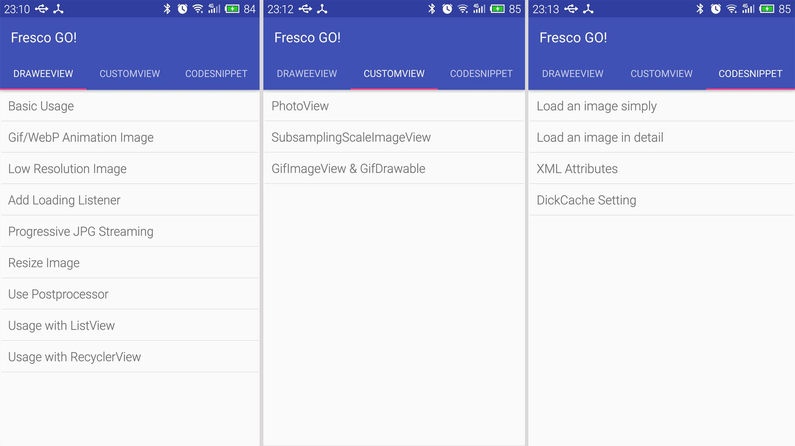
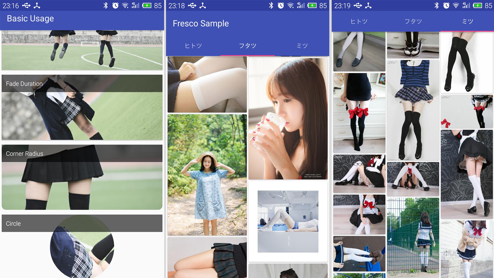

### Fresco Sample Usage
[中文版](doc/readme-cn.md) [日本語]()

### Introduction
This is an Android demo project created as **sample usage** for [Fresco](https://github.com/facebook/fresco) in detail, which is an awesome **image loading library** for Android Application.

### Project Content
- Simply load an image
- Detailed usage, such as ScaleType, Rounded Corner, Circle, Fade Animation, Placeholder, Failure Image, Retry Image, ProgressBar, PressedState Overlay
- Gif or webPng animation image
- Litsener of loading
- Progressive streaming
- Resize image
- Postprocessor
- Usage with ListView
- Usage with RecyclerView
- Usage with 3rd-party ImageView, such as PhotoView, SubsamplingSacleImageView, GifDrawable
- Code snippet 

### Advantage of Fresco
- Memory manager
- Progressive Streaming
- Gif and webPng support
- Customizable  display of UI
- Customizable ways of loading

For more info, please go to [frescolib.org](http://frescolib.org/)

### Download APK
[GitHub Release](https://github.com/kaedea/Fresco-Sample-Usage/releases)

### Screenshot

